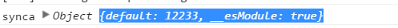

# webpack

## day01

- ### 安装webpack依赖，直接在命令行输入

    `webpack **`

    `webapck --config **(配置文件)`

- ### 配置webpack.config.js文件在里面写入配置项

1. entry指定入口文件

1. output指定输出文件 [name]  [hash] [chunkhash]

1. loader配置，同种类型的资源使用loader 如：loader: "style!css"或者loaders:[style,css]

1. react的webpack配置

1. 资源引入方式,可以通过require引入或者直接在entry中配置引入

    如： day09_1: ['./src/demo1.jsx', './src/index1.css']

    或在文件中require('./index1.css');

1. 代码分割业务代码和vendor的代码,提取公共代码

    ```js
    webpack.optimize.CommonsChunkPlugin(
            /* chunkName= */
            "vendor",
            /* filename= */
            "vendor.bundle.js")
    ```

1. 配置webserver

    ```js
    npm iinstall --save-dev webpack-dev-server

    webserver//启动server

    ```
    webserver提供了监听功能，修改文件，会重新打包，但此时refresh 浏览器不会起作用，因为打包的结果是放在内存中，并没有反映到文件中

    _solution_: 配置public路径可以访问内存中打包的内容

    _自动刷新_:

    iframe模式:修改url地址

    如：http://localhost:8080/webpack-dev-server/html

    inline模式

    ```js

    webpack-dev-server

    //添加

     --inline //刷新浏览器

    --hot//热加载

    ```
    可以在webpack.config中配置webpack-dev-server不用在命令行中添加`--inline`和`--hot`

    在用es2015的模块模式写模块时，当模块定义default输出时,es2015语法在转换后

    在通过`import`导入的时候和通过`require`导入的时候会点不同,require引入时不会转换

    导入生成的值,在直接使用导入的结果时会有差异.

    ```js
    //es6，sync.js文件
    var a = 12233;
    export default a;
    ```
     ```js
     //es6导入
    import sync from './sync';
    console.log('sync', sync);
    ```

    ```js
    //require导入
    sync = require('./sync')
    console.log('sync', sync);
    ```
    导入经babel转换后

    ```js
    //console.log('sync', sync);require导入转换为下面的
    console.log('sync', sync);
    ```

    

    ```js
     //console.log('sync', sync);import导入转换为下面的
    console.log('sync', sync.default);
    ```
     

1. code splitting 异步加载

1. 代码块(chunk)

    entry chunk   normal chunk   initial chunk 三种chunk

1. 处理样式文件

    embed 样式文件

    separate 样式文件：

    


